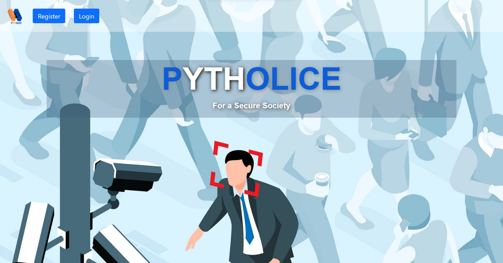
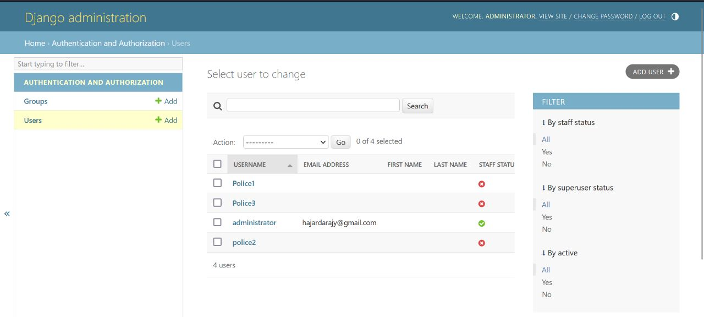
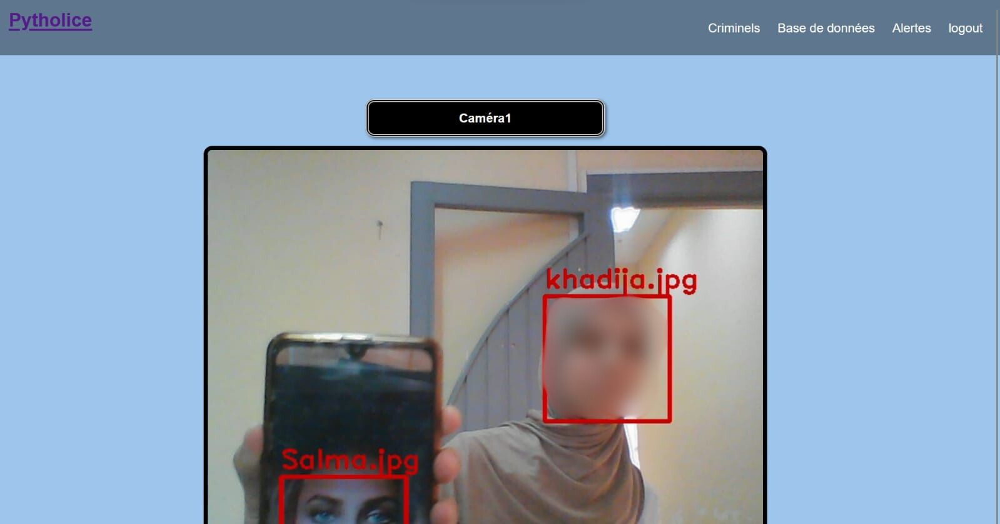
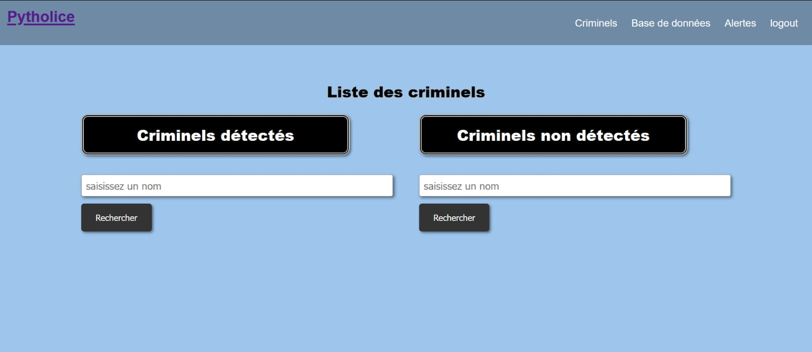
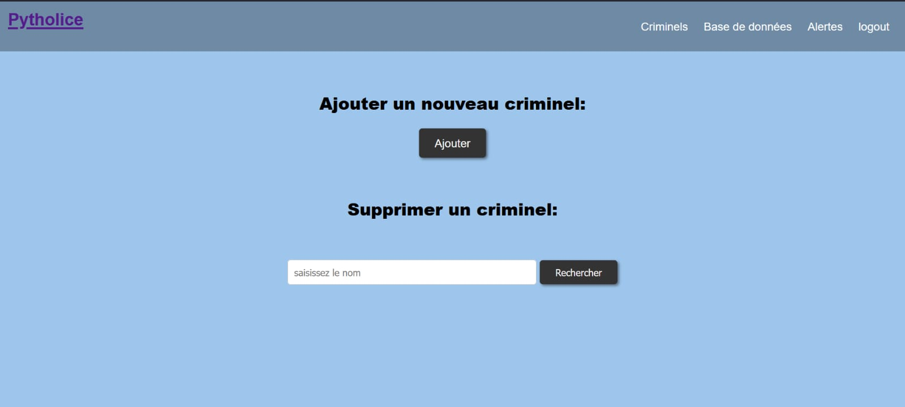
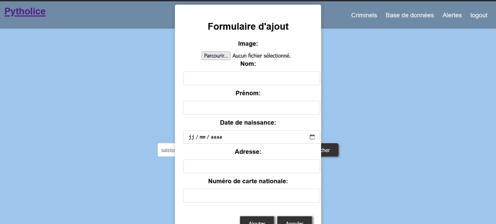
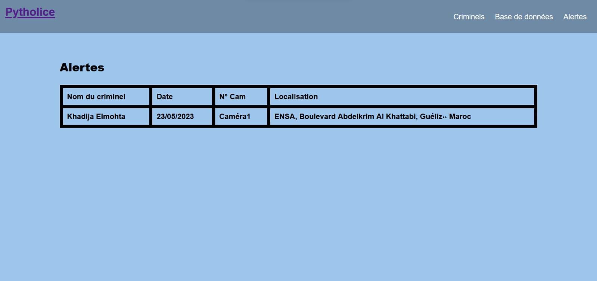

# PYTHOLICE  :  Facial Recognition and Real-time Tracking for Law Enforcement
## Overview
WEB application forthe detection off ugitives, mainly programmed in python, which aims to use facial recognition, motion detection, and real-time location to facilitate the search forfugitives by the forces.

  

## Introduction 
Facial recognition technology has become increasingly prevalent in biometric applications, particularly in authentication, access control, and surveillance systems. With the rise of sophisticated methods to bypass traditional security measures like passwords and keys, the need for more robust and secure authentication methods has become paramount. In response, researchers across various fields have turned to biometrics, which offers unparalleled security and effectiveness.

The project addresses the challenges faced by law enforcement agencies in traditional methods, such as slow and bureaucratic processes, difficulties in identifying criminals, and the management of large volumes of fugitives and missing persons.

This Python-based application leverages **facial recognition**, **motion detection**, and **real-time tracking** technologies to assist Police forces in locating fugitives and missing persons more efficiently. The implemented algorithms identify individuals from surveillance images and recordings and track their movements in real-time to aid in investigations and apprehensions.

## Features

- **Facial Recognition** : Identifying fugitives and missing persons from surveillance footage.
- **Real-time Tracking** : Tracking the movement of identified individuals in real-time.
- **Motion Detection** : Detecting and analyzing movements to enhance surveillance capabilities.
- **Efficiency Enhancement** : Improving the efficiency of law enforcement operations through automation and advanced technology.

## User Interface
**Home Page** :

**Login** : 

The admin page is designed for users with special privileges, such as administrators or website managers, to access authentication information and manage user accounts. 
**Cameras Page** :
The homepage after a Successful login opens with a captivating interface highlighting camera fields. At the center of the page, a frame is displayed, providing a live view through the website's built-in camera.

**Criminels Page** :

**page d’ajout et de suppression des criminels** :
The criminal database search page allows users to search for wanted or already detected criminals. At the center of the page, a search field is displayed, prompting users to enter the name of the criminal. 

**Form for adding a new criminal** :
The add and delete criminals page enables users to input new criminal data and remove existing entries. It features a user-friendly form for adding detailed criminal information, including photos, names, addresses, dates of birth, and national identification numbers. 

**Alertes Page** :
The alert page is designed to notify users of any detection situations. It is crafted to immediately capture users' attention upon opening and can be highlighted by an alert message. 

**PYTHOLICE** aims to bridge the gap between traditional law enforcement methods and modern technological advancements, ultimately enhancing the effectiveness and efficiency of investigations and law enforcement operations.

